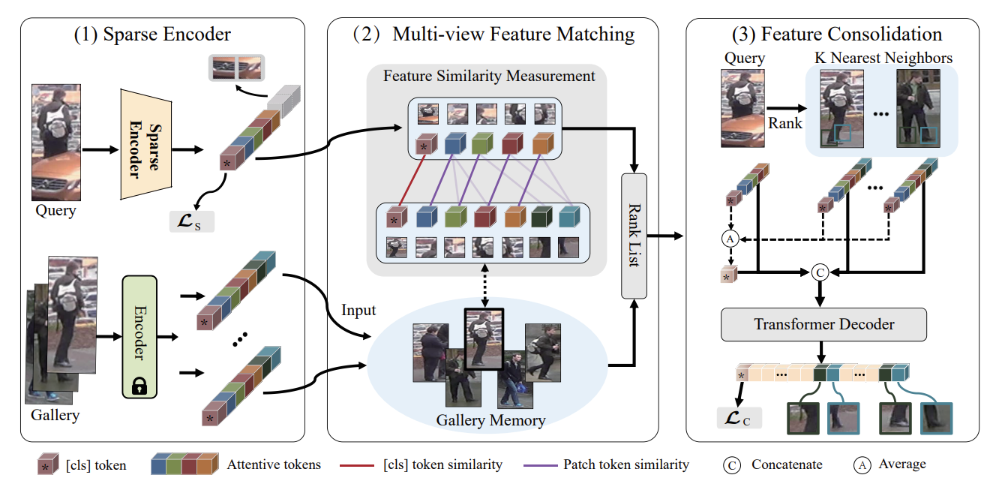
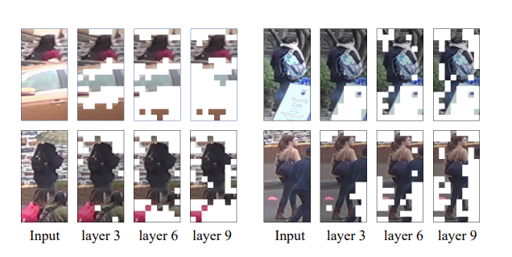

# Dynamic Feature Pruning and Consolidation for Occluded Person Re-Identification

The *official* repository for  [Dynamic Feature Pruning and Consolidation for Occluded Person Re-Identification](https://arxiv.org/pdf/2211.14742.pdf) achieves state-of-the-art performances on occluded person Re-ID.

## News
- 2023.03  FPC's code will be released coming soon.
- 2023.11We first updated the evaluation code, and we will continue updating. 

## Pipeline

## Visualization of the Patch Pruning Process

## Evaluation

#### 1. Requirements Installation

Install the necessary packages using the provided env.yaml file:

#### 2. Prepare Datasets

Download the Occluded or Holistic Person ReID datasets (e.g., Occluded-Duke). Unzip them and rename the folders under the `./data` directory.

#### 3. Prepare Checkpoints

Download Checkpoints from [this link](https://drive.google.com/file/d/1DrgUzoUTpiZLpPrWiQyz2_QeZ5z1GfXj/view?usp=share_link). Save the checkpoint file as `./FPC_Occ_Duke_reconstruction.pth`.

#### 4. Evaluate

Run the evaluation using the following command:
`python test.py --config_file configs/OCC_Duke/vit_transreid_stride.yml MODEL.DEVICE_ID "('0')" TEST.WEIGHT './FPC_Occ_Duke_reconstruction.pth'`

#### Acknowledgements

Our code is heavily built on [TransReid](https://github.com/damo-cv/TransReID/tree/main). 

